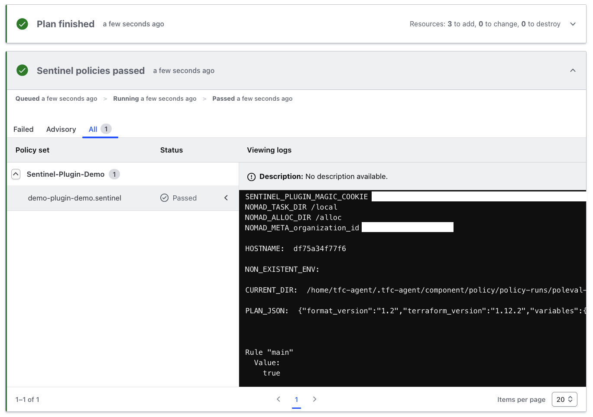

# Sentinel Plugin Demo

This repository demonstrates how to extend HashiCorp Sentinel with custom plugins and deploy them in HCP Terraform or Terraform Enterprise. The demo showcases a few functions/properties to print environment variables and read files. These are meant to demonstrate the capabilities of Sentinel plugins, not necessarily to be used in production.

## What This Repository Does

This demo provides a practical example of:

- Building custom Sentinel plugins using Go and the Sentinel SDK
- Extending Sentinel's capabilities with custom functions for environment variable access and file reading
- Testing plugins locally with the Sentinel CLI
- Preparing plugins for deployment in HCP Terraform or Terraform Enterprise environments

The plugin exposes several useful functions and properties:

- **Functions**: `getallenvs()`, `getenv(key)`, `getfile(path)`
- **Properties**: `envs`, `now`, `pwd`

## Repository Structure

```text
├── main.go              # Plugin entry point
├── plugin/              # Plugin implementation
│   ├── root.go         # Core plugin logic with functions and properties
│   └── root_test.go    # Comprehensive test suite
├── policies/           # Sentinel policies that use the plugin
│   ├── plugin-demo.sentinel
│   └── test/           # Policy tests
├── bin/                # Compiled plugin binaries (need for HCPT/TFE)
├── sentinel.hcl        # Policy Set configuration
├── Taskfile.yml        # Task runner configuration for local development
├── go.mod              # Go module definition
└── go.sum              # Go module checksums
```

## Building the Plugin

Compile the plugin binaries for multiple architectures using the provided task:

```bash
task plugin-build
```

This command builds:

- `bin/sentinel-plugin-demo` (Linux AMD64) - for HCP Terraform/Terraform Enterprise
- `bin/sentinel-plugin-demo-darwin` (macOS ARM64) - for local testing on Apple Silicon

The multi-architecture build enables testing locally on different platforms while preparing the Linux binary for deployment in HashiCorp's cloud environments.

## Testing

### Testing the Plugin Code

Run the Go test suite to verify plugin functionality:

```bash
go test ./plugin
```

The test suite includes comprehensive coverage of:

- Function registration and callable verification
- Return type validation
- Environment variable handling
- File system operations
- Edge cases and error conditions

### Testing Sentinel Policies

Test the Sentinel policies that use the plugin:

```bash
sentinel test -verbose policies/plugin-demo.sentinel
```

Or use the provided task for verbose output:

```bash
task sentinel-test
```

This runs the Sentinel test framework against your policies using the compiled plugin binary.

## Plugin Functions and Properties

### Functions

- **`getallenvs()`** - Returns a map of all environment variables
- **`getenv(key)`** - Returns the value of a specific environment variable
- **`getfile(path)`** - Returns the contents of a file as a string

### Properties

- **`envs`** - Property containing all environment variables as a map
- **`now`** - Property containing current timestamp information
- **`pwd`** - Property containing the current working directory

## Usage in Sentinel Policies

```hcl
import "plugin-demo" as pd

# Using functions
all_envs = pd.getallenvs()
home_dir = pd.getenv("HOME")
config_content = pd.getfile("/path/to/config.json")

# Using properties
current_envs = pd.envs
current_time = pd.now
working_dir = pd.pwd
```

### Example



## Deployment

1. Build the Linux binary: `task plugin-build`
2. Connect the repository to an HCP Terraform or Terraform Enterprise Policy Set
3. Configure your Sentinel policies to import and use the plugin

## References

- [Sentinel Plugin Documentation](https://developer.hashicorp.com/sentinel/docs/extending/plugins)
- [HashiCorp Sentinel SDK](https://github.com/hashicorp/sentinel-sdk)
- [Sentinel Testing Guide](https://developer.hashicorp.com/sentinel/docs/writing/testing)
- [HCP Terraform Sentinel Integration](https://developer.hashicorp.com/terraform/cloud-docs/policy-enforcement)

## Development

This plugin is built using:

- Go 1.23.4
- [HashiCorp Sentinel SDK](https://github.com/hashicorp/sentinel-sdk)
- [Task](https://taskfile.dev/) for build automation

To extend the plugin, add new functions to the `Func()` method or properties to the `Get()` method in `plugin/root.go`, then add corresponding tests in `plugin/root_test.go`.
